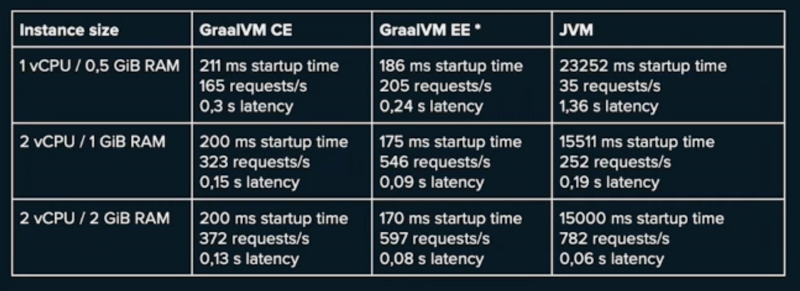
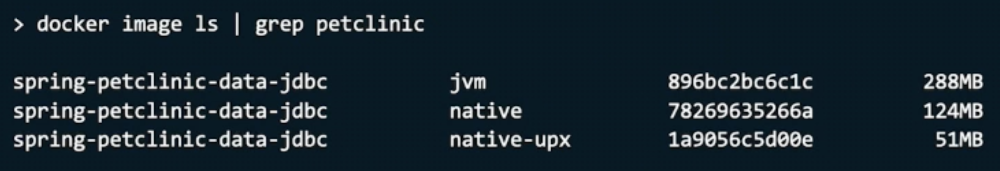

# SpringOne Essentials Day 3

## From Spring Native to Spring Boot 3

Motitz Halbrtter (boot), Sebastien Deleuze (framework)

Why compile to native?
Close to no startup time.
No warmup, no jit,
Lower resource usage and way smaller memory footspring because no jvm overheat.
Lower attack service only what is used is included (close world analysis).
No reflection.
Smaller images without jvm.

Use cases:
Recommended - low cpu, low memory use case, functions as a service. 
Scale to zero support by cloud providers.
Assess - Microservice, services with low usage, k8s, container distributes apps.
JVM - Apps with high cpu and memory, monolith app, high traffic.

History: Spring Native Beta.
Next: Spring Boot official support for native images.
Every spring native user should migrate to boot 3.

Demo Time:
Spring Initialier with GraalVM Native support.
Check the `HELP.md`.
Compile with native build packs or native tooling.
Use `sdkman` to manage a GraalVM installation.
`graalvm.buildtools.native` in gradle to enable it.
No other special dependency needed.
Boot 3 has it all build in.
Execution without JVM is shown.

You can migrate existing boot 2 apps to boot 3 with native support.
1. Upgrade to jdk 17
1. Upgrade to boot 3
1. Migrate to Jakarta EE9 (might take a lot of effort because of 3rd party libs)
1. Enable to native-maven-plugin (org.graalvm.buildtools)
1. Add `@ImportRuntimeHints` and Implement `RuntimeHintsRegistrar`
1. Add `@RegisterReflectionForBinding` for certain classes like mvc controllers for jackson binding.

Changes between native and boot 3:
Jdk baseline 17, GraalVM 22.3, Production grade quality, built into boot, most spring boot project supported.
Wider lib support, see graal metadata repo.
Zero spring or lib code substitution. 
Zero classes explicitly initialized at build time.
`logback.xml` supported.

Reachability metadata repository.
Spring tries to add native support to all libs use.
The repo is for 3rd party libs and the community can add support there.

Under the cover.
Building blocks.
GraaVM: native-image-compiler, native build tools, reachability metadata repository.
SpringBoot 3: AOT & native integration in boot plugins, native documentation.
Spring portfolio: AOT transformation native hints.
Paketo Buildpacks: Native Buildpacks.
Spring Framework 6: AOT transformation engine, AOT plugins.

Steps: Compule sources, resources -> AOT sources `:generateAotSources` `:aotClass`,
Proxies are written to disk.
AOT results can be then compile to native image or packed into a bootJar.

Run tests in native image: `mvn -PnativeTest clean test` | `gradle nativeTest`

Buildpacks or Native Build Tools.
Buildpacks build image inside a container.
No graalvm required only docker.
x64 supported, arm is ongoing.

Native Build Tools, is joined project with graalwm spring and micronaut.
Testing is supported.
You need to build in the target architecture.

Observability.
Actuator work in native images.
Tracing work as well with micrometer tracing.
As jvm agents won't work with native images.

Benchmarks: 

Container size is also quite reduced

upx compression can reduce even more.
But more memory consumption.

Commercial Support.
Bellsoft and vmware.
E2E support for native images.

It's only the beginning.
More AOT optimization to come.
Reflection free property binding.
Code generation for SpEL.
Removal CGLIB classes from final image.
More Hibernate optimizations.

## Configuring & Extending Spring Authorization Server

Joe Grandja, Steven Riesenberg, Laurentiu Spilca

Default configuration.
Start with initializer and add spring web and spring security.
Add the authorization server dependency and copy in the example from the docs.

Authorization server filter chain.
Exposes the default auth endpoints.
Registered clients is used to register OIDC clients.
The oath2 code flow is shown.
With consent page of spring.

Other example: custom claims.
With `OAuth2TokenCustomizer<JwtEncodingContext`.
Add custom claim and custom authorities.
Some more examples are demoed.
e.g. Request validator for localhost that is added to the code request auth provider.

Show proof-key example.
Client needs to send the proof key parameters.

Next example opaque tokens.
Token revocation of refresh-token is shown.

Extending a new Authorization Grant Type.
RFC 7523 Profile for Authorization Grants.
Exchange JWT Token for another.

## Demystifying Spring Internals

Madhura Bhave

How spring work behind the scenes?
It's, just annotations, right?
`@ComponentScan`, component & scan parts.
e.g. `@Service` or `@RestController`.
Scan package and child packages for components.
Create beans for components.

How are beans created?
Create a bean definition, a blueprint for a bean instance.
It holds metadata, like lazy, primary, scope, type, factory method name, lifecycle methods, and more.
One bean definition for each bean in the context.
`BeanFactory` & `BeanDefinitionFactory`.
`DefaultListableBeanFactory` implements both, it's the heart of spring.
`@Bean` allows to define beans beside the regular component.
`BeanFactory`(spring-beans.jar) is implemented by the `ApplicationContext` (spring-context.jar).
Extends the factory and adds `ApplicationEvents`, `Environment` , `MessageSource` and `@Configuration`.
`AbstractApplicationContest`, basic implementations.
`GenericApplicationContext`, most default one with a DefaultListableBeanFactory.
`AnnotationConfigApplicationContext` adds scanning and configuration support.
`@Configuration` is also a component, it's also picked up by the scan.
Each bean annotation creates a new bean definition.
The factory method is the method annotated with `@Bean`.

How does injection work?
DefaultListableBeansFactory hold the definitions the AnnotaioNConfigApplicationContext asks the factory about the beans.
Create Beans for bean definitions without dependencies and go up the tree and instantiate the required beans.

`ConfigurationClassPostProcessor` - how are configuration classes processed.
PostProcessors are wide spread concept in spring.
`BeanDefinitonRegistryPostProcessor` to add more definitions to the bean factory.

How to manually register beans in the application context.
Add custom post processor of type BeanDefinitonRegistryPostProcessor.
It register a new definition in the bean definition registry.

GraalVM utilized this manual registration.
How does graal do it.
Find main, find SpringApplication.run.
Would not know what to do.
Add reflection hint for all beans would be bad.
Use bean registration.
Bean definitions are generated into code (it's a bit more complicated but in essence).
This is done in the AOT step.
Check the `target/aotSources` to see bean definitions generated.

## Spring Cloud Stream Past, Present & Future

Oleg Z, Glenn Renfro

What is streaming?
Event stream processing (ESP): taking actions on a series of data that originates from a system that produces continuous data.
What is a stream?
Processing Pattern.
Source -> Processor (0..n) -> Sink.
Source and sink are not connected directly most of the time.
Book: ? (too small).

Java 8 Functions use the same pattern Supplier -> Functions -> Consumer.

Demo time.
Functional Bean definitions for cloud functions are shown.
The function became a rest endpoint.
They show how to use the rabbit binder.
The same function is also bound to rabbit.
The method still is a rest endpoint.

Apply this to a "business" case.
From a monolithic approach to functions.
Map steps to supplier, processor and consumer.
Application properties to define a function definition. 
`generateReport|log` to compose functions.
Binding is created.
You can map the auto generated name to a simpler name.
The binding is mapped to a destination, here rabbitmq.
Suppliers are different, how are these triggered?
It's polled, by default every second.
The app is now 3 apps that will be independent.
They demo how fault tolerant the system is by shutting down parts of it.

What's new?
Support for BiFunctions, for e.g. Payload and Header.
Support for routing & filtering.
Observability with micrometer.
gRPC and RSocket support.
Support of Apache pulsar.
Schema Registry is coming back.
Multi-binder support for stream bridge.
AWS Lambda support for functions improved.
